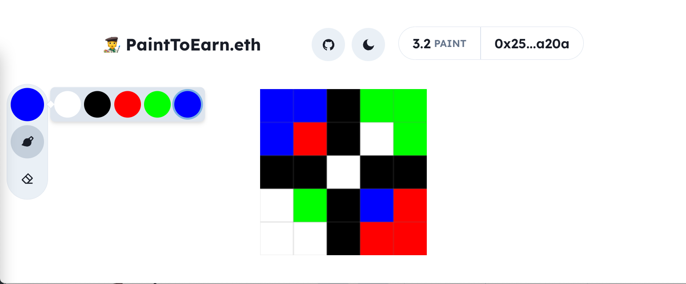

#  PaintToEarn.eth

> Earn $PAINT tokens by drawing on the ethereum blockchain



## Gameplay

This play-to-earn game allows players to paint on a canvas deployed on the Ethereum network.

Players must pay $PAINT tokens to paint pixels on the canvas.
The game will reward player engagement, re-distributing players more $PAINT than they've spent.

To prevent token farming, the canvas may lock changed pixels or player wallet addresses for a reasonable timespan.

## Development

Scaling is achieved by using the [Starknet](https://starkware.co/starknet/) layer 2 network.

Run the StarkNet transaction execution environment (similar to EVM):

```bash
source ./env/bin/activate   # activate python virtual env
nile node
```

Install frontend dependencies

```bash
yarn
```

Run frontend locally

```bash
yarn dev
```

#### Run tests

```bash
yarn test
```

## Acknowledgements

- [StarkWare](https://starkware.co/)
- [Starknet.js](https://github.com/seanjameshan/starknet.js)
- [Argent-x](https://github.com/argentlabs/argent-x)
- [Fracek's React, Starknet Boilerplate](https://github.com/fracek/starknet-react-example)
- [OpenZeppelin](https://github.com/OpenZeppelin/cairo-contracts)
- [Nile](https://github.com/OpenZeppelin/nile)

## Security

This project is still in a very early and experimental phase. It has never been audited nor thoroughly reviewed for security vulnerabilities. Not recommended for production use.

Please report any security issues you find by opening up an issue in this reposisitory.

## License

PaintToEarn.eth is released under the [AGPL-3.0-only](LICENSE) license.
